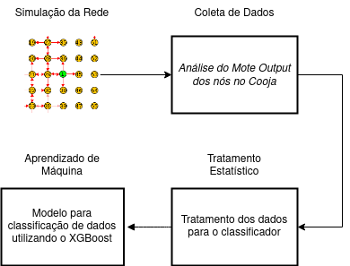
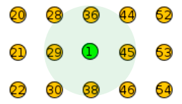
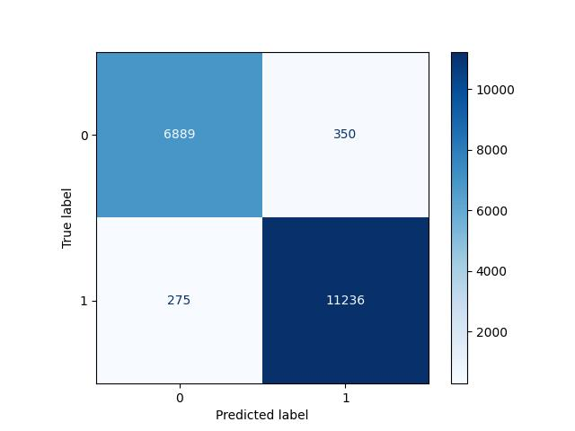

# Machine Learning aplicada a segurança em Internet das Coisas: detectando anomalias na comunicação e operação

Integrante: Alexandre Marques Carrer alexandremcarrer@gmail.com

Professora Orientadora: Cíntia Borges Margi

Co-orientador: Artur Jordão Lima Correia

Para instalar as bibliotecas necessárias para rodar o programa, após clonar o repositório, rode o comando abaixo:

```
pip install -r requirements.txt
```

## Resumo

"Esta pesquisa se trata de propor, implementar e avaliar um sistema detector de anomalias em uma rede de sensores sem fio se baseando em métricas de rede e padrões de utilização da arquitetura de dispositivos IoT à ela conectados utilizando um modelo de Machine Learning. Além de, com base nos resultados obtidos com a pesquisa, realizar a discussão do tradeoff de cibersegurança no sistema ao utilizar técnicas de inteligência artificial para monitoramento de integridade da rede."

## Motivação

- Utilização de redes de dispositivos de Internet das Coisas na sociedade e indústria: Segurança é requisito crítico
- Implementação de Sistema de Detecção de Intrusão utilizando as métricas de rede e de operação dos dispositivos
- Capacidade de detectar ataques "Day-Zero" utilizando aprendizado supervisionado

## Método

- Coleta e tratamento de dados de rede e operação dos dispositivos
- Modelo classificador binário para categorizar a ocorrência de ataque.
- Teste do modelo por meio de validação treino-teste e detecção de ataques _Out of Distribution_



### Coleta de Dados


- Utilização do simulador Contiki Cooja: Emulação de dispositivos IoT reais
- Implementação dos ataques Flooding, Blackhole e Greyhole (Artigo WTICG SBSeg 23)
- Coleta de dados pela interface de Mote Output do servidor da rede



### Tratamento Estatístico

- Janelamento dos dados utilizando uma fila (_First-in First-out_)
- Cálculo das médias e desvios padrões dos dados janelados
- Criação de dataset para o modelo de Aprendizagem supervisionada

### Aprendizado de Máquina

- Utilização do XGBoost Classifier para a detecção de intrusão
- Balanceamento dos dados por meio de ponderamento por classificação
- Cálculo das métricas de avaliação do modelo por meio da matriz de confusão dos resultados



## Resultados

- Sistema capaz de detectar intrusões com acurácia geral de 96%, Com o recall priorizado no sistema.
- Abordagem centralizada se demonstra como uma solução viável, mas acarreta no aumento da transmissão de pacotes na rede.

## Agradecimentos


